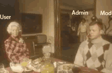

# r.sine Easter Eggs Finder


## Description
[r.sine](https://r.sine.com/index) (and [sine](https://sine.com/index)) is a website that displays a random image or gif each time the page is refreshed. 
The site can be accessed at https://sine.com/index. However, while poking around, 
I realized that if you replace "index" with other words, the images are no longer random. We have 3 possible cases. 
Either the word displays random images (e.g. https://sine.com/index ), or the word displays a single image 
(e.g. https://sine.com/admin), or the word displays a "buffer" image which is used for several words, 
probably when the word is not addressed to an image. I decided to use a script to discover all the possible words to use.
Yes, it's stupid. Welcome to the internet.


## Where to find r.sine

The most well-known URL is [https://r.sine.com/index](https://r.sine.com/index).  
Unfortunately, it is currently returning a *Forbidden* error and we no longer have access to that server.  
Thankfully, [https://sine.com/index](https://sine.com/index) still works and provides the same functionality.


## How it works

So it's a pretty straightforward process. We know that "index" offers random images (**Cond1**), 
that some words link to the same photo (**Cond2**) and that some words are only affiliated with a single image (**Cond3**).

- **Cond1**: random image → ```random_pictures.txt```
- **Cond2**: buffer image used for several words → ```same_pictures.txt```
- **Cond3**: single image for one word → ```unique_pictures.txt``` | single image for 2 or more words → ```unique_pictures_2words.txt```

So basically, we make requests for each word in the dictionary !
For this, I use either [Wikipedia's word frequency lists](https://en.wiktionary.org/wiki/Wiktionary:Frequency_lists/PG/2006/04/1-10000) 
or [```words.txt```](https://github.com/dwyl/english-words/blob/master/words.txt) from [english-words GitHub Repo](https://github.com/dwyl/english-words).
The word list I'm using has a problem... Those are only lowercase words. And certain words in lowercase do not give the same image as in uppercase so my script obviously tests both versions.

| https://sine.com/science                                           | https://sine.com/SCIENCE                                           |
|--------------------------------------------------------------------|--------------------------------------------------------------------|
|  |  |


Then I make a first request for a specific word and retrieve the image source code. 
I make a second request with the same word. If the 2 source codes are not similar, 
then we're in the case of the word "index" for example, where we'll only have random images (**Cond1**). 
If the 2 source codes are similar, this means that the image is necessarily identical and that the word leads 
to a specific image. 
Then, if the 2 source codes are identical, I check whether the latter is similar to a source code already known for 
the other words already screened. If it's identical, then the word leads to the "buffer" image (**Cond2**). 
If not, the word leads to a unique image (**Cond3**).

After that, I made the script to limit the number of requests, but that's a technicality that no one cares about.

## How to test word

Just replace ```index``` from https://sine.com/index with an other word (e.g. ```advice```) → https://sine.com/advice


For V4, I use [EazyPeazyE](https://www.reddit.com/r/rsine/comments/1c6woud/comment/l067o3m/?utm_source=share&utm_medium=web3x&utm_name=web3xcss&utm_term=1&utm_content=share_button)
suggestion by using https://sine.com/index?html=true. With this technique, below the photo we have the name associated with the image. I have with a threading of 8, I reloaded the page for 24 hours and retrieved all the words that came out and the source codes associated with the images to sort them as explained later.

## Sorted words and examples

``output`` (and version) are the post-processing folders. Sometimes my script makes errors because it goes too fast for server responses I think. So I go through the word list several times to be sure and I have a ``False Discovery Rate (FDR)`` folder to test it.

Here, I explain in more detail my reasoning and how I sorted.

- **Cond1**: random image → ```random_pictures.txt``` (e.g. https://sine.com/index for legal reasons, I don't display random images)


- **Cond2**: buffer image used for several words → ```same_pictures.txt``` (e.g. https://sine.com/nicetry)
  


- **Cond3**: 
  - single image for one word → ```unique_pictures.txt``` (e.g. https://sine.com/admin)
    
  - single image for 2 or more words → ```unique_pictures_2words.txt``` (e.g. https://sine.com/bird and https://sine.com/parrot)
  
    | https://sine.com/bird                                            | https://sine.com/parrot                                            |
    |------------------------------------------------------------------|--------------------------------------------------------------------|
    |  |  |

### Statistics

Statistics of V1:
- 370101 words tested 
  - 1 word does random pictures → index 
  - 1531 words lead to a unique things:
    - 1455 words do a unique images 
    - 29 images accessible via 2 words (58 words)
    - 2 images accessible via 3 words (6 words)
    - 11 words are specials... web page, redirection to youtube, snippet of r.sine code, pdf, broken images (repaired in html), mysteries

Statistics of V2 📈 (2.7x more words analyzed and 185 new words found):
- 1000316 words tested:
  - 1 word does random pictures → index 
  - 1716 words lead to a unique things:
    - 1631 words do a unique images 
    - 32 images accessible via 2 words (64 words)
    - 2 images accessible via 3 words (6 words)
    - 15 words are specials... web page, redirection to youtube, snippet of r.sine code, pdf, broken images (repaired in html), mysteries

Statistics of V3 📈 (2x more words analyzed and 24 new words found):
- 1000316 words + 1000001 number (0-1000000) tested:
  - 1 word does random pictures → index 
  - 1757 words lead to a unique things:
    - 1671 words do a unique images 
    - 32 images accessible via 2 words (64 words)
    - 2 images accessible via 3 words (6 words)
    - 15 words are specials... web page, redirection to youtube, snippet of r.sine code, pdf, broken images (repaired in html), mysteries

Statistics of V4 📈 (6094 new words found):

Thanks to [EazyPeazyE](https://www.reddit.com/r/rsine/comments/1c6woud/comment/l067o3m/?utm_source=share&utm_medium=web3x&utm_name=web3xcss&utm_term=1&utm_content=share_button)
by using https://sine.com/index?html=true, we have access to the name of the picture.

- 1000316 words + 1000001 number (0-1000000) tested:
  - 1 word does random pictures → index 
  - 7851 words lead to a unique things:
    - 7033 words do a unique images 
    - 335 images accessible via 2 words (670 words)
    - 29 images accessible via 3 words (87 words)
    - 9 images accessible via 4 words (36 words)
    - 25 words are specials... web page, redirection to youtube, snippet of r.sine code, pdf, broken images (repaired in html), mysteries
  

### List of words founds:
- [``compilation_unique_pictures.txt``](special_words/compilation_unique_pictures.txt)
- [``compilation_unique_pictures_multi_words.txt``](special_words/compilation_unique_pictures_multi_words.txt)

For those who are curious, the picture buffer corresponds to the words [``calm``](https://sine.com/calm) and [``noneed``](https://sine.com/neneed)

### List of words that do not lead to images:

*Note 1: some words are internet pages. They are no longer executable on r.sine.com but I host them (on Netlify) so that you have access to them.*

*Note 2: since certain words do not lead to images, in the [```special_words```](special_words) folder you will find the source code given by the word in question (in html or txt or pdf version)*

#### [```chicken```](https://sine.com/chicken)

A scientific chicken article in PDF format. Thank you r.sine.com 😅

#### [```call-me-a-farmer```](https://call-me-a-farmer-rsine.netlify.app) [```content```](https://content-rsine.netlify.app) [```farmer```](https://farmer-rsine.netlify.app) [```flagstop```](https://flagstop-rsine.netlify.app)

Music group promotion web pages ?

#### [```drinking```](https://sine.com/drinking)

It's a comic strip on a white background. The white background and the way the GIF is generated are quite atypical.

#### [```heaven```](https://heaven-rsine.netlify.app)

Web page to comment on photos of Rachel Sterne Twitter ?

#### [```lamppost```](https://lamppost-rsine.netlify.app) [```ready```](https://ready-rsine.netlify.app) [```smart```](https://smart-rsine.netlify.app)

Images that no longer work on r.sine.com. HTML work.

#### [``music``](https://sine.com/music)

A video of Peppa Pig 🐖

#### [```monitor```](https://sine.com/monitor) [```robots```](https://sine.com/robots) [```HISTORY```](https://sine.com/HISTORY)

A mystery... I have no idea about it

Except for robots: https://en.m.wikipedia.org/wiki/Robots.txt

I think this is a reference to the method to prevent Google bots from scanning the site. That makes rsine a deep web site, I guess

#### [```r```](https://sine.com/r)

I don't know if it's a bug or if it's intentional. It's a piece of code that helps us understand how images are returned to us on https://sine.com/index.

#### [``rathole``](https://sine.com/rathole)

🎸 Rathooooolllleeeee... 🎵

#### [``pong``](https://sine.com/pong)

🏓

#### [```topmen```](https://sine.com/topmen)

Leads to https://www.youtube.com/watch?v=yoy4_h7Pb3M (html broken but works on https://sine.com/topmen)

#### [```dickbong2```](https://sine.com/dickbong2) [```immigrantaxis```](https://sine.com/immigrantaxis) [```test-old```](https://sine.com/test-old)

These words are broken and we have no source code for the image so probably the photos no longer exist

#### [```javascript```](https://sine.com/javascript) [```somuchgritty```](https://sine.com/somuchgritty)

Access forbidden, Oddly, with ``index`` we can have access to them but why give the possibility of coming across these pages by chance?

#### [```hey+you```](https://sine.com/hey%2Byou)

Request more investigation. Oddly, with ``index`` we can have access to it but I don't have the source code but if we search for it manually I can't find them
However, there is this image which has almost the same name: [https://sine.com/heyyou](https://sine.com/heyyou)

#### [```loaded? don't take chances with pickups!```](https://sine.com/loaded?%20don%27t%20take%20chances%20with%20pickups!)

Probably this image but I can't display it on r.sine.com [https://vdarchive.newmedialab.cuny.edu/items/show/229](https://vdarchive.newmedialab.cuny.edu/items/show/229)

## Is it done ?

I think we found everything, then if we looked carefully... the creator left a clue 😉 but you won't find it in this GitHub 😉

## Disclaimer

The images on r.sine.com may offend the sensibilities of users. If you do not have the majority (of your country), 
I disclaim all responsibility for what you find on this site. This GitHub project is just a curiosity about another 
Internet curiosity.
